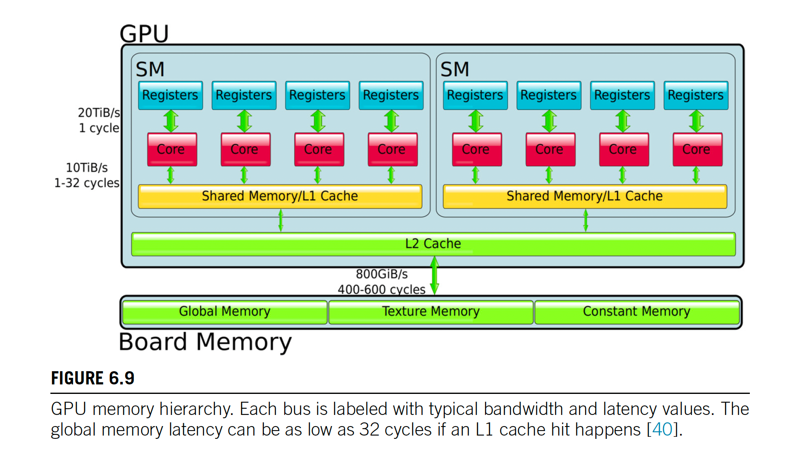
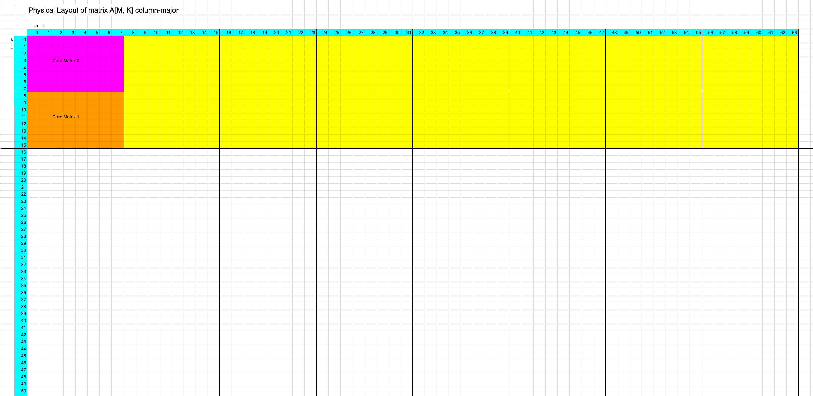
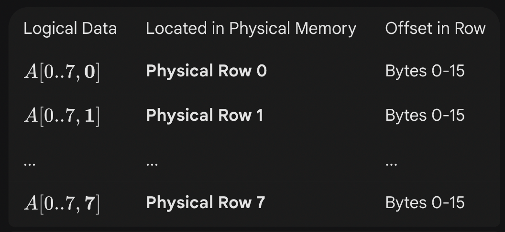

# Keys: The primary differences are in threading model and in separate physical memories
- the smallest executable unit of parallelism on a CUDA device comprises 32 threads (termed a warp of threads)
- Modern NVIDIA GPUs can support up to 2048 active threads concurrently per multiprocessor (see Features and Specifications of the CUDA C++ Programming Guide) On GPUs with 80 multiprocessors, this leads to more than 160,000 concurrently active threads.
- Because separate registers are allocated to all active threads, no swapping of registers or other state need occur when switching among GPU threads. Resources stay allocated to each thread until it completes its execution.

# Best Practices
- To use CUDA, data values must be transferred from the host to the device. These transfers are costly in terms of performance and should be minimized.  
For example, transferring two matrices to the device to perform a matrix addition and then transferring the results back to the host will not realize much performance benefit. The issue here is the number of operations performed per data element transferred. For the preceding procedure, assuming matrices of size $N \times N$, there are $N^2$ operations (additions) and $3N^2$ elements transferred, so the ratio of operations to elements transferred is 1:3 or O(1). Performance benefits can be more readily achieved when this ratio is higher. For example, a matrix multiplication of the same matrices requires N3 operations (multiply-add), so the ratio of operations to elements transferred is O(N), in which case the larger the matrix the greater the performance benefit. The types of operations are an additional factor, as additions have different complexity profiles than, for example, trigonometric functions. It is important to include the overhead of transferring data to and from the device in determining whether operations should be performed on the host or on the device.

- All kernel launches are asynchronous, as are memory-copy functions with the Async suffix on their names.

- it is necessary to synchronize the CPU thread with the GPU by calling `cudaDeviceSynchronize()` immediately before starting and stopping the CPU timer. `cudaDeviceSynchronize()` blocks the calling CPU thread until all CUDA calls previously issued by the thread are completed.

# Memory Optimization
## Check PCIe specs
```bash
# lspci -vv

# Search for NVIDIA
af:00.0 3D controller: NVIDIA Corporation TU104GL [Tesla T4] (rev a1)
	Subsystem: NVIDIA Corporation TU104GL [Tesla T4]
	Control: I/O- Mem+ BusMaster+ SpecCycle- MemWINV- VGASnoop- ParErr+ Stepping- SERR+ FastB2B- DisINTx+
	Status: Cap+ 66MHz- UDF- FastB2B- ParErr- DEVSEL=fast >TAbort- <TAbort- <MAbort- >SERR- <PERR- INTx-
	Latency: 0
	Interrupt: pin A routed to IRQ 434
	NUMA node: 2
	Region 0: Memory at ed000000 (32-bit, non-prefetchable) [size=16M]
	Region 1: Memory at 39bfc0000000 (64-bit, prefetchable) [size=256M]
	Region 3: Memory at 39bff0000000 (64-bit, prefetchable) [size=32M]
	Capabilities: [60] Power Management version 3
		Flags: PMEClk- DSI- D1- D2- AuxCurrent=375mA PME(D0+,D1-,D2-,D3hot+,D3cold+)
		Status: D0 NoSoftRst+ PME-Enable- DSel=0 DScale=0 PME-
	Capabilities: [68] #00 [0080]
	Capabilities: [78] Express (v2) Endpoint, MSI 00
		DevCap:	MaxPayload 256 bytes, PhantFunc 0, Latency L0s unlimited, L1 <64us
			ExtTag+ AttnBtn- AttnInd- PwrInd- RBE+ FLReset- SlotPowerLimit 0.000W
		DevCtl:	Report errors: Correctable- Non-Fatal+ Fatal+ Unsupported-
			RlxdOrd+ ExtTag+ PhantFunc- AuxPwr- NoSnoop-
			MaxPayload 256 bytes, MaxReadReq 512 bytes
		DevSta:	CorrErr- UncorrErr- FatalErr- UnsuppReq- AuxPwr+ TransPend-
		LnkCap:	Port #0, Speed 8GT/s, Width x16, ASPM not supported, Exit Latency L0s <1us, L1 <4us
			ClockPM+ Surprise- LLActRep- BwNot- ASPMOptComp+
		LnkCtl:	ASPM Disabled; RCB 64 bytes Disabled- CommClk+
			ExtSynch- ClockPM+ AutWidDis- BWInt- AutBWInt-
		LnkSta:	Speed 8GT/s, Width x16, TrErr- Train- SlotClk+ DLActive- BWMgmt- ABWMgmt-
		DevCap2: Completion Timeout: Range AB, TimeoutDis+, LTR-, OBFF Via message
		DevCtl2: Completion Timeout: 50us to 50ms, TimeoutDis-, LTR-, OBFF Disabled
		LnkCtl2: Target Link Speed: 8GT/s, EnterCompliance- SpeedDis-
			 Transmit Margin: Normal Operating Range, EnterModifiedCompliance- ComplianceSOS-
			 Compliance De-emphasis: -6dB
		LnkSta2: Current De-emphasis Level: -6dB, EqualizationComplete+, EqualizationPhase1+
			 EqualizationPhase2+, EqualizationPhase3+, LinkEqualizationRequest-
	Capabilities: [c8] MSI-X: Enable+ Count=6 Masked-
		Vector table: BAR=0 offset=00b90000
		PBA: BAR=0 offset=00ba0000
	Capabilities: [100 v1] Virtual Channel
		Caps:	LPEVC=0 RefClk=100ns PATEntryBits=1
		Arb:	Fixed- WRR32- WRR64- WRR128-
		Ctrl:	ArbSelect=Fixed
		Status:	InProgress-
		VC0:	Caps:	PATOffset=00 MaxTimeSlots=1 RejSnoopTrans-
			Arb:	Fixed- WRR32- WRR64- WRR128- TWRR128- WRR256-
			Ctrl:	Enable+ ID=0 ArbSelect=Fixed TC/VC=01
			Status:	NegoPending- InProgress-
	Capabilities: [258 v1] L1 PM Substates
		L1SubCap: PCI-PM_L1.2- PCI-PM_L1.1- ASPM_L1.2- ASPM_L1.1- L1_PM_Substates+
		L1SubCtl1: PCI-PM_L1.2- PCI-PM_L1.1- ASPM_L1.2- ASPM_L1.1-

		L1SubCtl2:
	Capabilities: [128 v1] Power Budgeting <?>
	Capabilities: [420 v2] Advanced Error Reporting
		UESta:	DLP- SDES- TLP- FCP- CmpltTO- CmpltAbrt- UnxCmplt- RxOF- MalfTLP- ECRC- UnsupReq- ACSViol-
		UEMsk:	DLP- SDES- TLP- FCP- CmpltTO- CmpltAbrt- UnxCmplt- RxOF- MalfTLP- ECRC- UnsupReq+ ACSViol-
		UESvrt:	DLP+ SDES+ TLP- FCP+ CmpltTO- CmpltAbrt- UnxCmplt- RxOF+ MalfTLP+ ECRC- UnsupReq- ACSViol-
		CESta:	RxErr- BadTLP- BadDLLP- Rollover- Timeout- NonFatalErr-
		CEMsk:	RxErr+ BadTLP+ BadDLLP+ Rollover+ Timeout+ NonFatalErr+
		AERCap:	First Error Pointer: 00, GenCap- CGenEn- ChkCap- ChkEn-
	Capabilities: [600 v1] Vendor Specific Information: ID=0001 Rev=1 Len=024 <?>
	Capabilities: [900 v1] #19
	Capabilities: [bb0 v1] #15
	Capabilities: [bcc v1] Single Root I/O Virtualization (SR-IOV)
		IOVCap:	Migration-, Interrupt Message Number: 000
		IOVCtl:	Enable- Migration- Interrupt- MSE- ARIHierarchy+
		IOVSta:	Migration-
		Initial VFs: 16, Total VFs: 16, Number of VFs: 0, Function Dependency Link: 00
		VF offset: 4, stride: 1, Device ID: 0000
		Supported Page Size: 00000573, System Page Size: 00000001
		Region 0: Memory at ee000000 (32-bit, non-prefetchable)
		Region 1: Memory at 000039bec0000000 (64-bit, prefetchable)
		Region 3: Memory at 000039bfd0000000 (64-bit, prefetchable)
		VF Migration: offset: 00000000, BIR: 0
	Capabilities: [c14 v1] Alternative Routing-ID Interpretation (ARI)
		ARICap:	MFVC- ACS-, Next Function: 1
		ARICtl:	MFVC- ACS-, Function Group: 0
	Kernel driver in use: nvidia
	Kernel modules: nvidia_drm, nvidia
```
In the context of PCIe (Peripheral Component Interconnect Express), "Speed 8GT/s" refers to the data transfer rate or speed of the PCIe interface. Let's break down what this means:

PCIe: PCIe is a high-speed serial computer expansion bus standard used for connecting various hardware components like graphics cards, network cards, storage controllers, and more to the motherboard of a computer. It provides a high-speed data transfer pathway between these components and the CPU.

Speed: The speed of a PCIe interface is typically measured in gigatransfers per second (GT/s). One GT/s is equivalent to one billion data transfers per second. This metric represents how quickly data can be sent and received between the components connected through PCIe.

8GT/s: When you see "Speed 8GT/s," it means that the PCIe interface is operating at a speed of 8 gigatransfers per second. This is a common speed setting for PCIe slots and is often referred to as PCIe Gen3 (third generation). PCIe Gen3 has a maximum theoretical bandwidth of approximately 8 gigabits per second per lane (in each direction, so 16 gigabits per second for a full-duplex connection).

Keep in mind that PCIe comes in different generations, and each generation offers different speeds. For example:

PCIe Gen1: Speed of 2.5GT/s
PCIe Gen2: Speed of 5GT/s
PCIe Gen3: Speed of 8GT/s
PCIe Gen4: Speed of 16GT/s
PCIe Gen5: Speed of 32GT/s
The speed of the PCIe interface is a crucial factor when considering the performance of components connected to it, such as graphics cards, storage devices, and expansion cards. It determines the maximum data transfer rate that can be achieved between these components and the rest of the computer system.

## Convert PCIe speed to bandwidth
To convert the PCIe speed of 8GT/s to bandwidth, you need to consider the data transfer rate per lane and the number of lanes in the PCIe connection.

PCIe Gen3 (8GT/s): This generation of PCIe has a data transfer rate of 8 gigatransfers per second per lane.

Bandwidth calculation: To calculate the bandwidth in gigabits per second (Gbps) for a single lane of PCIe Gen3, you can simply use the speed value:

Bandwidth per lane = Speed (GT/s) * 1 (lane) = 8 Gbps

Now, if you have a PCIe connection with multiple lanes, such as x4 (4 lanes) or x16 (16 lanes), you can calculate the total bandwidth by multiplying the bandwidth per lane by the number of lanes.

For example:

PCIe Gen3 x4: 8 Gbps (per lane) * 4 (lanes) = 32 Gbps
PCIe Gen3 x16: 8 Gbps (per lane) * 16 (lanes) = 128 Gbps
So, the bandwidth for a PCIe Gen3 connection depends on the number of lanes in the specific PCIe slot or connection. In the case of 8GT/s, the bandwidth per lane is 8 Gbps, and the total bandwidth depends on how many lanes are available in the specific PCIe configuration.

## Pinned Memory
Higher bandwidth between the host and the device is achieved when using page-locked (or pinned) memory.

Page-locked or pinned memory transfers attain the highest bandwidth between the host and the device. On PCIe x16 Gen3 cards, for example, pinned memory can attain roughly 12 GB/s transfer
rates.

Pinned memory is allocated using the cudaHostAlloc() functions in the Runtime API. The bandwidthTest CUDA Sample shows how to use these functions as well as how to measure memory transfer performance.

### Why pin memory?
- Pagable memory is transferred using the host CPU
- Pinned memory is transferred using the DMA engines
  - Frees the CPU for asynchronous execution
  - Achieves a higher percent of peak bandwidth

### ALLOCATING PINNED MEMORY
- cudaMallocHost(...) / cudaHostAlloc(...)
  - Allocate/Free pinned memory on the host
  - Replaces malloc/free/new
- cudaFreeHost(...)
  - Frees memory allocated by cudaMallocHost or cudaHostAlloc
- cudaHostRegister(...) / cudaHostUnregister(...)
  - Pins/Unpins pagable memory (making it pinned memory)
  - Slow so don't do often

## Asynchronous and Overlapping Transfers with Computation
- Data transfers between the host and the device using `cudaMemcpy()` are blocking transfers; that is, control is returned to the host thread only after the data transfer is complete.

- The `cudaMemcpyAsync()` function is a non-blocking variant of `cudaMemcpy()` in which control is returned immediately
to the host thread. In contrast with `cudaMemcpy()`, the asynchronous transfer version requires pinned host memory (If you want truly asynchronous behavior (e.g. overlap of copy and compute) then the memory must be pinned. If it is not pinned, there won’t be any runtime errors, but the copy will not be asynchronous - it will be performed like an ordinary `cudaMemcpy()`.) (see Pinned Memory), and it contains an additional argument, a stream ID.

# CUDA Driver API
`/usr/lib/x86_64-linux-gnu/libcuda.so` is copied on the system during the installation of the device driver.
User app --> CUDA Driver API (libcuda.so) --> /dev/nvidia0(1, 2, 3) + IOCTL --> GPU Driver (nvidia.ko) --> GPUs

The communication between libcuda.so and the nvidia.ko kernel module typically involves the use of IOCTL (Input/Output Control) operations rather than standard system calls. IOCTLs are a mechanism used in Unix-like operating systems to communicate between user space and kernel space for device-specific operations.

When libcuda.so needs to communicate with the nvidia.ko kernel module, it usually issues IOCTL requests to the appropriate device file associated with the GPU driver. These IOCTL requests carry specific commands and data payloads that are understood by the kernel module.

While the exact IOCTLs used by the CUDA runtime library (libcuda.so) to communicate with the NVIDIA GPU driver (nvidia.ko) are not publicly documented by NVIDIA, it's known that IOCTLs are the primary mechanism for passing commands and data between user space and kernel space in NVIDIA's GPU driver architecture.

Here's a general overview of how IOCTLs are typically used for communication between libcuda.so and nvidia.ko:

Device File: The GPU driver (nvidia.ko) exposes one or more device files (e.g., /dev/nvidia0) that user space applications can open to interact with the driver.
IOCTL Operations: libcuda.so issues IOCTL requests to the device file associated with the GPU driver. These IOCTL requests carry specific command codes (defined by the driver) and optional data payloads.
Driver Handling: When the GPU driver (nvidia.ko) receives an IOCTL request from libcuda.so, it processes the request, performs the requested operation (e.g., allocating GPU memory, launching a kernel), and returns the result back to libcuda.so.
Kernel Space Execution: The IOCTL request is handled by the GPU driver in kernel space. The driver interacts directly with the GPU hardware to perform the requested operation, such as programming the GPU's command processor or accessing GPU memory.
Response to User Space: Once the operation is complete, the GPU driver sends a response back to libcuda.so through the IOCTL request. This response may contain status information, error codes, or other relevant data.
By using IOCTL operations, libcuda.so and nvidia.ko can efficiently communicate and perform GPU-related operations, while maintaining the necessary isolation and security between user space and kernel space in the operating system.

# CUDA module
A CUDA (Compute Unified Device Architecture) module is a collection of CUDA code that can be compiled and executed on NVIDIA GPUs. It typically consists of one or more kernels, which are functions written in CUDA C or CUDA C++ that are executed on the GPU.

Here's a simple example of a CUDA module that adds two arrays:

Example: Adding Two Arrays with CUDA
- CUDA Kernel: This is the function that runs on the GPU.
- Host Code: This is the function that runs on the CPU and launches the CUDA kernel.

*CUDA Kernel (Device Code)*
```C++
__global__ void add(int *a, int *b, int *c, int n) {
    int index = threadIdx.x + blockIdx.x * blockDim.x;
    if (index < n) {
        c[index] = a[index] + b[index];
    }
}
```

*Host Code*
```C++
#include <iostream>
#include <cuda_runtime.h>

__global__ void add(int *a, int *b, int *c, int n);

int main() {
    int n = 10;
    int size = n * sizeof(int);
    int h_a[10], h_b[10], h_c[10];

    // Initialize arrays
    for (int i = 0; i < n; i++) {
        h_a[i] = i;
        h_b[i] = i * 2;
    }

    int *d_a, *d_b, *d_c;

    // Allocate device memory
    cudaMalloc((void**)&d_a, size);
    cudaMalloc((void**)&d_b, size);
    cudaMalloc((void**)&d_c, size);

    // Copy arrays from host to device
    cudaMemcpy(d_a, h_a, size, cudaMemcpyHostToDevice);
    cudaMemcpy(d_b, h_b, size, cudaMemcpyHostToDevice);

    // Launch kernel with 1 block of 10 threads
    add<<<1, 10>>>(d_a, d_b, d_c, n);

    // Copy result from device to host
    cudaMemcpy(h_c, d_c, size, cudaMemcpyDeviceToHost);

    // Print results
    for (int i = 0; i < n; i++) {
        std::cout << h_a[i] << " + " << h_b[i] << " = " << h_c[i] << std::endl;
    }

    // Free device memory
    cudaFree(d_a);
    cudaFree(d_b);
    cudaFree(d_c);

    return 0;
}
```

Explanation
CUDA Kernel (add function):

This function is executed on the GPU.
__global__ indicates that this is a kernel function.
The kernel adds corresponding elements of arrays a and b and stores the result in array c.
Host Code:

The host code is written in standard C++.
It allocates memory on the GPU using cudaMalloc.
It copies data from the host to the GPU using cudaMemcpy.
It launches the CUDA kernel using the <<<>>> syntax.
It copies the result back from the GPU to the host using cudaMemcpy.
Finally, it frees the allocated GPU memory using cudaFree.
This example demonstrates the basic structure of a CUDA program, including memory management and kernel invocation.

# CUDA Context
```C++
// Binds the specified CUDA context to the calling CPU thread.
// Ref: https://docs.nvidia.com/cuda/cuda-driver-api/group__CUDA__CTX.html#group__CUDA__CTX_1gbe562ee6258b4fcc272ca6478ca2a2f7
CUresult cuCtxSetCurrent ( CUcontext ctx )

// main.cpp
if (options.num_cuda_ctx > 1) {
  auto* exp_config = tf_options_.config.mutable_gpu_options()->mutable_experimental();
  exp_config->set_own_cuda_context(true);
  int num_cuda_context_sms = options.num_cuda_context_sms > 0 ? options.num_cuda_context_sms : -1;
  exp_config->set_cuda_context_sms(num_cuda_context_sms);
  exp_config->set_share_between_ctx(options.share_between_ctx);
  exp_config->set_cuda_context_idx(options.num_cuda_ctx);
  exp_config->set_device_resource_tag(model_name_);
  tf_options_.target = "mc@" + tf_options_.target;
})

// tensorflow/core/common_runtime/gpu/gpu_device.cc
const auto& gpu_exp_config = options.config.gpu_options().experimental();
if (gpu_exp_config.own_cuda_context()) {
  int device_id = tf_device_id.value();
  int ctx_id = gpu_exp_config.cuda_context_idx();  // NOTE: reuse cuda context
  se::cuda::AddCudaContextWithSms(device_id, ctx_id, gpu_exp_config.cuda_context_sms());
  tf_device_id = se::cuda::PackDeviceContextId(device_id, ctx_id);
  VLOG(1) << "Combine Device: " << tf_device_id.value()
          << " & Context: " << ctx_id << " => " << intptr_t(device_id);
}
```

# Memory Hierarchy


# CTA - Cooperative Thread Array
https://docs.nvidia.com/cuda/parallel-thread-execution/#cooperative-thread-arrays

# GEMM modes
Like most BLAS libraries [1, 17, 56, 59], LibShalom
supports four types of GEMM kernels, NN, NT, TN and TT. Here,
T and N respectively stand for a transposed and not transposed
matrix. For example, GEMM for matrices A · B under the NT mode
means matrix B is transposed (T) but matrix A is not (N).
<br/>

# Row and Column
Math notation: a matrix with shape `[M, K]` means it has `M` rows and `N` columns.  
CUDA notation: `M` goes along `y` axis and `N` goes along `x` axis.

NumPy follows the exact math notation:
```Python
>>> import numpy as np
>>> a = np.array([[1, 2, 3, 4], [5, 6, 7, 8], [9, 10, 11, 12]])
>>> a
array([[ 1,  2,  3,  4],
       [ 5,  6,  7,  8],
       [ 9, 10, 11, 12]])
>>> a.shape
(3, 4)
```

## NumPy axis
https://numpy.org/doc/stable/glossary.html#term-axis

Another term for an array dimension. Axes are numbered left to right; axis 0 is the first element in the shape tuple.

In a two-dimensional vector, the elements of axis 0 are rows and the elements of axis 1 are columns.

# cuDNN
## Get cudnn version
```Bash
cat <<EOF > main.c
#include <stdio.h>

size_t cudnnGetVersion();

int main(int argc, char** argv) {
  printf("CUDNN_VERSION: %ld\n", cudnnGetVersion());
}
EOF

gcc -Wl,-rpath=./lib -Wl,--dynamic-linker=./lib/ld-linux-x86-64.so.2 main.c ./lib/libcudnn.so.8 ./lib/libc.so.6 ./lib/ld-linux-x86-64.so.2 -o main

./main
```


Or
```Bash
cat <<EOF > main.c
#include <stdio.h>
#include <dlfcn.h>

typedef size_t (*func)();

int main(int argc, char** argv) {
  void* handle = dlopen("./lib/libcudnn.so.8", RTLD_NOW | RTLD_GLOBAL);
  if (!handle) {
    fprintf(stderr, "ERROR: %s\n", dlerror());
    return 1;
  }
  
  void* func_ptr = dlsym(handle, "cudnnGetVersion");
  printf("CUDNN_VERSION: %ld\n", reinterpret_cast<func>(func_ptr)());
}
EOF

gcc -Wl,-rpath=./lib -Wl,--dynamic-linker=./lib/ld-linux-x86-64.so.2 main.c ./lib/libdl.so.2 ./lib/libc.so.6 ./lib/ld-linux-x86-64.so.2 -o main
```

# Shared Memory Bank Conflicts
https://github.com/Kobzol/hardware-effects-gpu/tree/master/bank-conflicts#bank-conflicts
CUDA threads can use a small amount of scratchpad "shared" memory, that is located on chip and therefore has faster access times than the global GPU DRAM. This memory is accessed through multiple memory banks, which allows multiple threads to access the shared memory in parallel.

Which bank is used for a given memory access is determined by the number of banks, size of each bank and finally the memory address. For modern CUDA architectures, bank size is usually 4 bytes (https://docs.nvidia.com/cuda/pascal-tuning-guide/index.html#shared-memory-bandwidth) and there are 32 banks, one for each thread in a warp. Banks are assigned to addresses sequentially, according to this formula: bank = (address / 4) % 32. Therefore address 1024 goes to bank 0, 1028 goes to bank 1 etc.

This means that if 32 threads access 32 4-byte shared memory locations at once, the access can proceed completely in parallel if they use all 32 memory banks. However, if multiple threads use the same memory bank, those accesses will be effectively serialized. This is called a bank conflict. In the worst case, if all threads use the same memory bank, the memory accesses could take up to 32x longer. There is however an exception to this when multiple threads read from the exact same address (which implies that they use the same memory bank). In this case only one bank access will be generated, the value will be broadcasted to all of the threads and the bank conflict will be avoided.

# Asynchronous Barrier
https://docs.nvidia.com/cuda/cuda-c-programming-guide/index.html#asynchronous-barrier

## Temporal Splitting and Five Stages of Synchronization

# Generic proxy and Async proxy
https://docs.nvidia.com/cuda/parallel-thread-execution/index.html#proxies

# Dynamic Shared Memory Size
```C++
    printf("  Total amount of dynamic shared memory:         %zu bytes\n",
           deviceProp.sharedMemPerBlockOptin);
```

# Warp Divergence
---

### **1. What is a Warp in CUDA?**

* In CUDA, threads are grouped into **warps** of 32 threads.
* All threads in a warp execute **in lockstep** on the GPU's SIMD-like hardware: they share the same program counter and execute the same instruction at the same time.

---

### **2. What is Warp Divergence?**

* **Warp divergence** happens when threads in the same warp follow **different execution paths**, usually due to **branching (if/else, switch, loops with varying iterations, etc.)**.
* Since all threads in a warp must execute the same instruction together, the GPU must **serialize divergent paths**.

---

### **3. Example**

```cpp
__global__ void divergence_example(int *data) {
    int tid = threadIdx.x + blockIdx.x * blockDim.x;

    if (tid % 2 == 0) {
        // Path A: even threads
        data[tid] = tid * 2;
    } else {
        // Path B: odd threads
        data[tid] = tid * 3;
    }
}
```

* In each warp (32 threads), half are even, half are odd.
* Threads split into **two execution paths**:

  1. Execute Path A for even threads, while odd threads sit idle.
  2. Execute Path B for odd threads, while even threads sit idle.
* **Result:** warp takes \~2× longer than if all threads had followed the same branch.

---

### **4. Why is it a Problem?**

* Divergence **reduces parallel efficiency**: the warp’s throughput is determined by the *longest path*, and inactive threads waste cycles.
* Worst case: if all 32 threads take **different paths**, execution becomes fully serialized.

---

### **5. Key Insights**

* Warp divergence only occurs **within a warp**. Different warps can diverge independently without hurting each other.
* Structured, data-parallel code minimizes divergence.

---

### **6. Strategies to Reduce Divergence**

* **Data reordering:** arrange data so that threads in the same warp follow the same branch.
* **Predication:** replace branches with conditional assignments when possible:

```cpp
data[tid] = (tid % 2 == 0) ? tid * 2 : tid * 3;
```

* **Algorithm redesign:** avoid divergent control flow inside performance-critical kernels.
* **Warp specialization:** assign entire warps to a specific task instead of mixing.

---

✅ **In short:** Warp divergence happens when threads in the same warp take different execution paths. The GPU then serializes those paths, leading to idle threads and performance loss.

Would you like me to also explain **how modern NVIDIA compilers and hardware (Volta and later) partially mitigate warp divergence**?

# Shared Memory
## The Hardware Architecture: 32 Banks
Shared memory is physically built from 32 separate memory banks. Each bank is 4 bytes (32 bits) wide.
- Width: $32 \text{ banks} \times 4 \text{ bytes/bank} = \mathbf{128 \text{ bytes}}$.
- This 128-byte horizontal slice is one "Physical Row".

Each line below represents one Physical Row (128 Bytes). Addressing works by "Row Index" (Vertical) and "Bank Index" (Horizontal).
```
                   Bank 0    Bank 1    Bank 2   ...   Bank 31
                +---------+---------+---------+-----+---------+
Physical Row 0: | 4 Bytes | 4 Bytes | 4 Bytes | ... | 4 Bytes |  <-- Total: 128 Bytes
                +---------+---------+---------+-----+---------+
Physical Row 1: | 4 Bytes | 4 Bytes | 4 Bytes | ... | 4 Bytes |  <-- Total: 128 Bytes
                +---------+---------+---------+-----+---------+
Physical Row 2: | 4 Bytes | 4 Bytes | 4 Bytes | ... | 4 Bytes |
                +---------+---------+---------+-----+---------+
      ...
```

# How the WGMMA unit reads Core Matrix 0
Ref: https://docs.nvidia.com/cuda/archive/12.4.0/parallel-thread-execution/index.html#shared-memory-layout-for-wgmma-mma-async-m64nnk16

Given matrix A[M=64, K=64] in column-major layout (M is contiguous dimension),<br/>
To understand how the WGMMA unit reads Core Matrix 0 ($A_{0..7, 0..7}$), we have to follow the data from the logical matrix indices down to the physical shared memory banks.

The short answer is: It gathers 8 separated slices from 8 different physical rows simultaneously.Here is the step-by-step visualization of that read operation.

## The Logical Target: Core Matrix 0
The WGMMA unit wants to load the top-left $8 \times 8$ block of your matrix A.
- Rows: $0 \dots 7$
- Cols: $0 \dots 7$
- Total Data: $8 \times 8 = 64$ elements (bf16).

## The Physical Location (The "Slicing")
Because your data is Column-Major (physically $M$ is contiguous) and stored in 128-byte physical rows in Shared Memory:
- **Physical Row 0** holds the entire Column 0 ($M=0 \dots 63$).
- **Physical Row 1** holds the entire Column 1
- ....
- **Physical Row 7** holds the entire Column 7.

<br/>

Therefore, Core Matrix 0 is not stored as a contiguous square. It is "sliced" vertically across the first 8 physical rows of Shared Memory.<br/>


## The "Read" Operation
When the wgmma instruction executes, it effectively issues 8 parallel requests to Shared Memory to assemble this block.
Look at where that data lives in the Physical Rows above:

- From Physical Row 0: It needs the first 16 bytes (Col 0, M=0..7).

- From Physical Row 1: It needs the first 16 bytes (Col 1, M=0..7).

- ...

- From Physical Row 7: It needs the first 16 bytes (Col 7, M=0..7).

Visualizing the Access: The hardware must "slice" vertically through the Physical Rows.
```
                Bank 0-3 (Bytes 0-15)       Bank 4-31
              +-----------------------+-----------------------+
Phys Row 0:   | [TARGET DATA: Col 0]  |     (Ignored)         |
              +-----------------------+-----------------------+
Phys Row 1:   | [TARGET DATA: Col 1]  |     (Ignored)         |
              +-----------------------+-----------------------+
   ...        |         ...           |        ...            |
              +-----------------------+-----------------------+
Phys Row 7:   | [TARGET DATA: Col 7]  |     (Ignored)         |
              +-----------------------+-----------------------+
```

**Why Swizzling is Required**<br/>
Without swizzling, every single one of those "TARGET DATA" blocks would be in Banks 0-3.
- The hardware cannot read 8 different values from Bank 0 at the same time. This is a Bank Conflict.

With SWIZZLE_128B: The hardware shuffles the "Physical" location. Even though Col 1 is logically similar to Col 0, the swizzle logic shifts it to different banks in Physical Row 1.
```
                 Bank 0-3      Bank 4-7      Bank 8-11 ...
              +-------------+-------------+-------------+
Phys Row 0:   | [Col 0 tgt] |             |             |  <-- Hit Banks 0-3
              +-------------+-------------+-------------+
Phys Row 1:   |             | [Col 1 tgt] |             |  <-- Hit Banks 4-7
              +-------------+-------------+-------------+
Phys Row 2:   |             |             | [Col 2 tgt] |  <-- Hit Banks 8-11
              +-------------+-------------+-------------+
```
Now, the WGMMA instruction can issue one massive parallel read, and every "slice" comes from a different bank.

**Summary:**
- Physical Row: The 128-byte horizontal strip of 32 parallel memory banks.
- Your Code: Maps 1 Logical Column $\rightarrow$ 1 Physical Row.
- WGMMA: Needs to read small chunks from 8 different Physical Rows simultaneously to build its tile.

## Matrix Descriptor
Refs: 
- https://docs.nvidia.com/cuda/archive/12.4.0/parallel-thread-execution/index.html#matrix-descriptor-format
- https://docs.nvidia.com/cuda/archive/12.4.0/parallel-thread-execution/index.html#strides

### Leading dimension byte offset (LDO)
Leading dimension byte offset of matrix A or B is the distance, in bytes, between two adjacent core matrices in the K dimension.<br/>
Usually, LDO = 0 when a swizzle mode is used.

### Stride dimension byte offset (SDO)
Stride dimension byte offset of matrix A or B is the distance, in bytes, between two adjacent core matrices in the M or N dimension.<br/>
SDO is defined as the jump to the next Core Matrix (8 rows down) and we need to take the shape of matrix A or B in shared memory into account.
For example, if A has shape 64x64, then SDO = 8 * 64 * sizeof(DataType). <br/>
The WGMMA unit fetches data in "atoms" whose size depends on the swizzle mode. <br/>
The hardware treats the start of the next row of a core matrix = the start of the current row + atom size (128B or 64B or 32B).

### The Default Hardwired Definition (tnspA = 0)
The WGMMA hardware is designed by default for Row-Major matrices (where $K$ is the inner/contiguous dimension).
- Default "Leading Dimension Offset (LDO)": Controls $K$ (The inner dimension).  
- Default "Stride Dimension Offset" (SDO): Controls $M$ (The outer dimension / rows). 

### The "Transpose" Switch (tnspA = 1)
When the WGMMA unit sees this bit set to 1, it performs a Hardware Swap:
- Leading Dimension Offset is now routed to control $M$.
- Stride Dimension Offset is now routed to control $K$.
