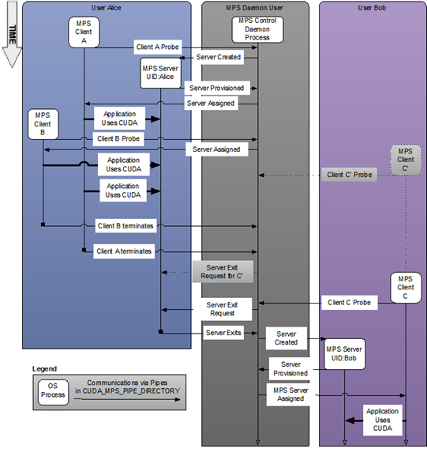

# MPS
  
https://docs.nvidia.com/deploy/mps/index.html#server  

The MPS control daemon is responsible for the startup and shutdown of MPS servers. **The control daemon allows at most one MPS server to be active at a time.** When an MPS client connects to the control daemon, the daemon launches an MPS server if there is no server active. The MPS server is launched with the same user id as that of the MPS client.

**If there is an MPS server already active and the user ID of the server and client match, then the control daemon allows the client to proceed to connect to the server.** If there is an MPS server already active, but the server and client were launched with different user ID’s, the control daemon requests the existing server to shutdown once all its clients have disconnected. Once the existing server has shutdown, the control daemon launches a new server with the same user ID as that of the new user’s client process. This is shown in the figure above where user Bob starts client C’ before a server is available. Only once user Alice’s clients exit is a server created for user Bob and client C’.

The MPS control daemon does not shutdown the active server if there are no pending client requests. This means that the active MPS server process will persist even if all active clients exit. The active server is shutdown when either a new MPS client, launched with a different user id than the active MPS server, connects to the control daemon or when the work launched by the clients has caused a fault. This is shown in the example above, where the control daemon issues a server exit request to Alice’s server only once user Bob starts client C, even though all of Alice’s clients have exited.