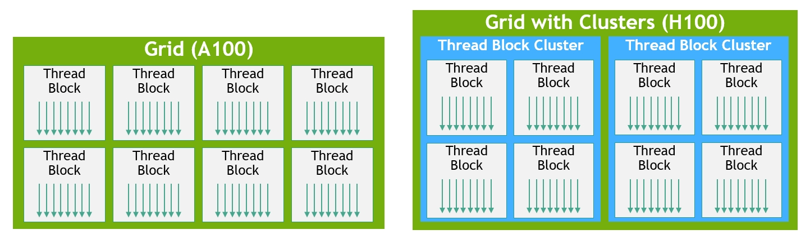

# Thread Block Clusters
https://docs.nvidia.com/cuda/cuda-c-programming-guide/index.html#thread-block-clusters
https://developer.nvidia.com/blog/nvidia-hopper-architecture-in-depth/#thread_block_clusters

NVIDIA Hopper Architecture adds a new optional level of hierarchy, Thread Block Clusters, that allows for further possibilities when parallelizing applications. A thread block can read from, write to, and perform atomics in shared memory of other thread blocks within its cluster. This is known as Distributed Shared Memory. As demonstrated in the CUDA C++ Programming Guide, there are applications that cannot fit required data within shared memory and must use global memory instead. Distributed shared memory can act as an intermediate step between these two options.

## Distributed Shared Memory
https://docs.nvidia.com/cuda/cuda-c-programming-guide/index.html#distributed-shared-memory

Thread block clusters introduced in compute capability 9.0 provide the ability for threads in a thread block cluster to access shared memory of all the participating thread blocks in a cluster.

A cluster is a group of thread blocks that are guaranteed to be concurrently scheduled onto a group of SMs, where the goal is to enable efficient cooperation of threads across multiple SMs. The clusters in H100 run concurrently across SMs within a GPC.

A GPC is a group of SMs in the hardware hierarchy that are always physically close together. Clusters have hardware-accelerated barriers and new memory access collaboration capabilities discussed in the following sections. A dedicated SM-to-SM network for SMs in a GPC provides fast data sharing between threads in a cluster.

## Warp-specialization (ws)
Warp-specialization, introduced in CUTLASS 3.0, divides warps into data movement (producer) and computation (consumer) roles. This technique aims to better overlap data movement and computation, improving memory and tensor core latency hiding.

