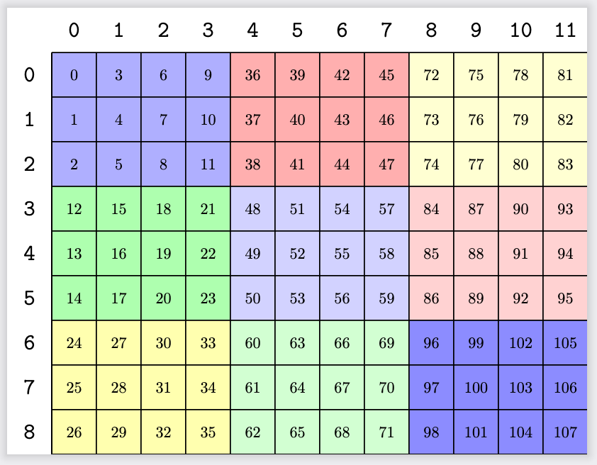

# cute::tile_to_shape
cutlass/include/cute/layout.hpp
```C++
cute::tile_to_shape(Layout<Shape,Stride> const& block, TargetShape const& target_shape)
```
This function replicates the `block` layout so that the result layout matches the target shape. 

For example,
```C++
  Layout block = make_layout(Shape<_3, _4>{}, Stride<_1, _3>{});
  auto target_shape = Shape<_9, _12>{};
  auto result_layout = tile_to_shape(block, target_shape);
```
result_layout: `((_3,_3),(_4,_3)):((_1,_12),(_3,_36))` <br/>

