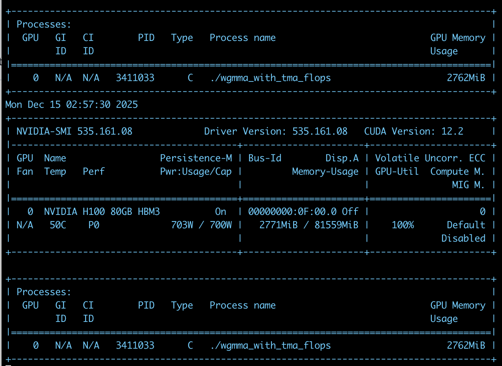

## Prerequisites
```Bash
GPU: NVIDIA H100
Driver Version: >=535.129.03
CUDA Version: 12.4
```

## Build
```Bash
make
```

## Run
```Bash
./main
```
Matrices `A`, `B`, and `D` are dumped to `output.txt`.


# WGMMA
https://docs.nvidia.com/cuda/parallel-thread-execution/#asynchronous-multiply-and-accumulate-instruction-wgmma-mma-async

## Matrices A and B
Matrices in shared memory are organized into a number of smaller matrices called core matrices. Each core matrix has 8 rows or columns and the size of each row is 16 bytes. The core matrices occupy contiguous space in shared memory.

Matrix A is made up of 8x2 core matrices and Matrix B is made up of 2x(N/8) core matrices. This section describes the layout of the core matrices for each shape.

<br/>
```
sA layout:
   0    1    2    3    4    5    6    7     64   65   66   67   68   69   70   71 
   8    9   10   11   12   13   14   15     72   73   74   75   76   77   78   79 
  16   17   18   19   20   21   22   23     80   81   82   83   84   85   86   87 
  24   25   26   27   28   29   30   31     88   89   90   91   92   93   94   95 
  32   33   34   35   36   37   38   39     96   97   98   99  100  101  102  103 
  40   41   42   43   44   45   46   47    104  105  106  107  108  109  110  111 
  48   49   50   51   52   53   54   55    112  113  114  115  116  117  118  119 
  56   57   58   59   60   61   62   63    120  121  122  123  124  125  126  127 

 128  129  130  131  132  133  134  135    192  193  194  195  196  197  198  199 
 136  137  138  139  140  141  142  143    200  201  202  203  204  205  206  207 
 144  145  146  147  148  149  150  151    208  209  210  211  212  213  214  215 
 152  153  154  155  156  157  158  159    216  217  218  219  220  221  222  223 
 160  161  162  163  164  165  166  167    224  225  226  227  228  229  230  231 
 168  169  170  171  172  173  174  175    232  233  234  235  236  237  238  239 
 176  177  178  179  180  181  182  183    240  241  242  243  244  245  246  247 
 184  185  186  187  188  189  190  191    248  249  250  251  252  253  254  255 

 256  257  258  259  260  261  262  263    320  321  322  323  324  325  326  327 
 264  265  266  267  268  269  270  271    328  329  330  331  332  333  334  335 
 272  273  274  275  276  277  278  279    336  337  338  339  340  341  342  343 
 280  281  282  283  284  285  286  287    344  345  346  347  348  349  350  351 
 288  289  290  291  292  293  294  295    352  353  354  355  356  357  358  359 
 296  297  298  299  300  301  302  303    360  361  362  363  364  365  366  367 
 304  305  306  307  308  309  310  311    368  369  370  371  372  373  374  375 
 312  313  314  315  316  317  318  319    376  377  378  379  380  381  382  383 

 384  385  386  387  388  389  390  391    448  449  450  451  452  453  454  455 
 392  393  394  395  396  397  398  399    456  457  458  459  460  461  462  463 
 400  401  402  403  404  405  406  407    464  465  466  467  468  469  470  471 
 408  409  410  411  412  413  414  415    472  473  474  475  476  477  478  479 
 416  417  418  419  420  421  422  423    480  481  482  483  484  485  486  487 
 424  425  426  427  428  429  430  431    488  489  490  491  492  493  494  495 
 432  433  434  435  436  437  438  439    496  497  498  499  500  501  502  503 
 440  441  442  443  444  445  446  447    504  505  506  507  508  509  510  511 

 512  513  514  515  516  517  518  519    576  577  578  579  580  581  582  583 
 520  521  522  523  524  525  526  527    584  585  586  587  588  589  590  591 
 528  529  530  531  532  533  534  535    592  593  594  595  596  597  598  599 
 536  537  538  539  540  541  542  543    600  601  602  603  604  605  606  607 
 544  545  546  547  548  549  550  551    608  609  610  611  612  613  614  615 
 552  553  554  555  556  557  558  559    616  617  618  619  620  621  622  623 
 560  561  562  563  564  565  566  567    624  625  626  627  628  629  630  631 
 568  569  570  571  572  573  574  575    632  633  634  635  636  637  638  639 

 640  641  642  643  644  645  646  647    704  705  706  707  708  709  710  711 
 648  649  650  651  652  653  654  655    712  713  714  715  716  717  718  719 
 656  657  658  659  660  661  662  663    720  721  722  723  724  725  726  727 
 664  665  666  667  668  669  670  671    728  729  730  731  732  733  734  735 
 672  673  674  675  676  677  678  679    736  737  738  739  740  741  742  743 
 680  681  682  683  684  685  686  687    744  745  746  747  748  749  750  751 
 688  689  690  691  692  693  694  695    752  753  754  755  756  757  758  759 
 696  697  698  699  700  701  702  703    760  761  762  763  764  765  766  767 

 768  769  770  771  772  773  774  775    832  833  834  835  836  837  838  839 
 776  777  778  779  780  781  782  783    840  841  842  843  844  845  846  847 
 784  785  786  787  788  789  790  791    848  849  850  851  852  853  854  855 
 792  793  794  795  796  797  798  799    856  857  858  859  860  861  862  863 
 800  801  802  803  804  805  806  807    864  865  866  867  868  869  870  871 
 808  809  810  811  812  813  814  815    872  873  874  875  876  877  878  879 
 816  817  818  819  820  821  822  823    880  881  882  883  884  885  886  887 
 824  825  826  827  828  829  830  831    888  889  890  891  892  893  894  895 

 896  897  898  899  900  901  902  903    960  961  962  963  964  965  966  967 
 904  905  906  907  908  909  910  911    968  969  970  971  972  973  974  975 
 912  913  914  915  916  917  918  919    976  977  978  979  980  981  982  983 
 920  921  922  923  924  925  926  927    984  985  986  987  988  989  990  991 
 928  929  930  931  932  933  934  935    992  993  994  995  996  997  998  999 
 936  937  938  939  940  941  942  943   1000 1001 1002 1003 1004 1005 1006 1007 
 944  945  946  947  948  949  950  951   1008 1009 1010 1011 1012 1013 1014 1015 
 952  953  954  955  956  957  958  959   1016 1017 1018 1019 1020 1021 1022 1023 


sB layout:
   0    8   16   24   32   40   48   56    128  136  144  152  160  168  176  184    256  264  272  280  288  296  304  312    384  392  400  408  416  424  432  440    512  520  528  536  544  552  560  568    640  648  656  664  672  680  688  696    768  776  784  792  800  808  816  824    896  904  912  920  928  936  944  952 
   1    9   17   25   33   41   49   57    129  137  145  153  161  169  177  185    257  265  273  281  289  297  305  313    385  393  401  409  417  425  433  441    513  521  529  537  545  553  561  569    641  649  657  665  673  681  689  697    769  777  785  793  801  809  817  825    897  905  913  921  929  937  945  953 
   2   10   18   26   34   42   50   58    130  138  146  154  162  170  178  186    258  266  274  282  290  298  306  314    386  394  402  410  418  426  434  442    514  522  530  538  546  554  562  570    642  650  658  666  674  682  690  698    770  778  786  794  802  810  818  826    898  906  914  922  930  938  946  954 
   3   11   19   27   35   43   51   59    131  139  147  155  163  171  179  187    259  267  275  283  291  299  307  315    387  395  403  411  419  427  435  443    515  523  531  539  547  555  563  571    643  651  659  667  675  683  691  699    771  779  787  795  803  811  819  827    899  907  915  923  931  939  947  955 
   4   12   20   28   36   44   52   60    132  140  148  156  164  172  180  188    260  268  276  284  292  300  308  316    388  396  404  412  420  428  436  444    516  524  532  540  548  556  564  572    644  652  660  668  676  684  692  700    772  780  788  796  804  812  820  828    900  908  916  924  932  940  948  956 
   5   13   21   29   37   45   53   61    133  141  149  157  165  173  181  189    261  269  277  285  293  301  309  317    389  397  405  413  421  429  437  445    517  525  533  541  549  557  565  573    645  653  661  669  677  685  693  701    773  781  789  797  805  813  821  829    901  909  917  925  933  941  949  957 
   6   14   22   30   38   46   54   62    134  142  150  158  166  174  182  190    262  270  278  286  294  302  310  318    390  398  406  414  422  430  438  446    518  526  534  542  550  558  566  574    646  654  662  670  678  686  694  702    774  782  790  798  806  814  822  830    902  910  918  926  934  942  950  958 
   7   15   23   31   39   47   55   63    135  143  151  159  167  175  183  191    263  271  279  287  295  303  311  319    391  399  407  415  423  431  439  447    519  527  535  543  551  559  567  575    647  655  663  671  679  687  695  703    775  783  791  799  807  815  823  831    903  911  919  927  935  943  951  959 

  64   72   80   88   96  104  112  120    192  200  208  216  224  232  240  248    320  328  336  344  352  360  368  376    448  456  464  472  480  488  496  504    576  584  592  600  608  616  624  632    704  712  720  728  736  744  752  760    832  840  848  856  864  872  880  888    960  968  976  984  992 1000 1008 1016 
  65   73   81   89   97  105  113  121    193  201  209  217  225  233  241  249    321  329  337  345  353  361  369  377    449  457  465  473  481  489  497  505    577  585  593  601  609  617  625  633    705  713  721  729  737  745  753  761    833  841  849  857  865  873  881  889    961  969  977  985  993 1001 1009 1017 
  66   74   82   90   98  106  114  122    194  202  210  218  226  234  242  250    322  330  338  346  354  362  370  378    450  458  466  474  482  490  498  506    578  586  594  602  610  618  626  634    706  714  722  730  738  746  754  762    834  842  850  858  866  874  882  890    962  970  978  986  994 1002 1010 1018 
  67   75   83   91   99  107  115  123    195  203  211  219  227  235  243  251    323  331  339  347  355  363  371  379    451  459  467  475  483  491  499  507    579  587  595  603  611  619  627  635    707  715  723  731  739  747  755  763    835  843  851  859  867  875  883  891    963  971  979  987  995 1003 1011 1019 
  68   76   84   92  100  108  116  124    196  204  212  220  228  236  244  252    324  332  340  348  356  364  372  380    452  460  468  476  484  492  500  508    580  588  596  604  612  620  628  636    708  716  724  732  740  748  756  764    836  844  852  860  868  876  884  892    964  972  980  988  996 1004 1012 1020 
  69   77   85   93  101  109  117  125    197  205  213  221  229  237  245  253    325  333  341  349  357  365  373  381    453  461  469  477  485  493  501  509    581  589  597  605  613  621  629  637    709  717  725  733  741  749  757  765    837  845  853  861  869  877  885  893    965  973  981  989  997 1005 1013 1021 
  70   78   86   94  102  110  118  126    198  206  214  222  230  238  246  254    326  334  342  350  358  366  374  382    454  462  470  478  486  494  502  510    582  590  598  606  614  622  630  638    710  718  726  734  742  750  758  766    838  846  854  862  870  878  886  894    966  974  982  990  998 1006 1014 1022 
  71   79   87   95  103  111  119  127    199  207  215  223  231  239  247  255    327  335  343  351  359  367  375  383    455  463  471  479  487  495  503  511    583  591  599  607  615  623  631  639    711  719  727  735  743  751  759  767    839  847  855  863  871  879  887  895    967  975  983  991  999 1007 1015 1023 
```

### Matrix Descriptor Format
https://docs.nvidia.com/cuda/parallel-thread-execution/#asynchronous-warpgroup-level-matrix-shared-memory-layout-matrix-descriptor


## Matrix D
```C++
  int shape_d[] = {M, N};
  int stride_d[] = {N, 1};

  int* D_indexes = get_indexes(threadIdx.x, stride_d);
```
`D_indexes` are generated from the following layout:

<br/>
Ref: https://docs.nvidia.com/cuda/parallel-thread-execution/#matrix-fragments-for-wgmma-mma-async-m64nnk16
<br/>

# Profiling
```Bash
./wgmma_with_tma_flops 512 256 32 100000
```
GPU Utilization:<br/>
```Bash
nvidia-smi -i 0 -l 1
```
