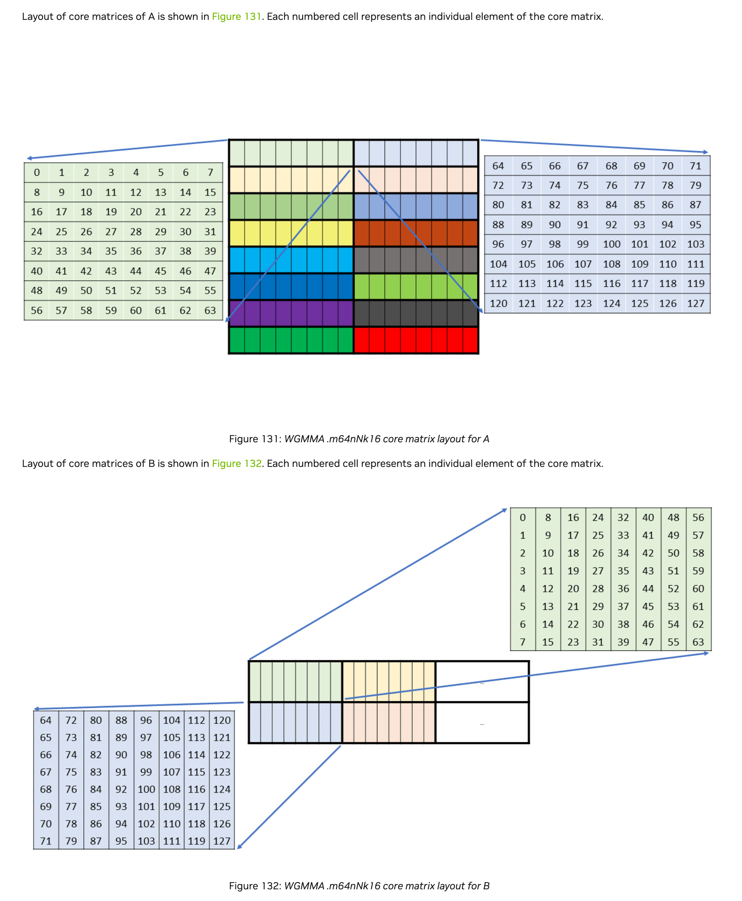
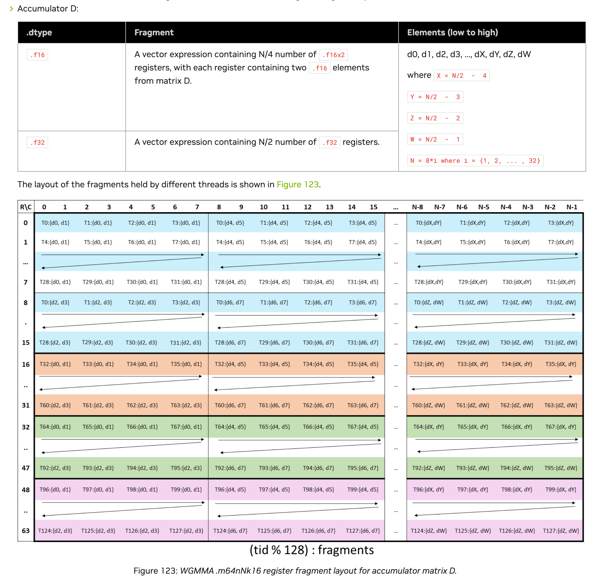

## Prerequisites
```Bash
GPU: NVIDIA H100
Driver Version: >=535.129.03
CUDA Version: 12.4
```

## Build
```Bash
make
```

## Run
```Bash
./wgmma_with_tma
```
Matrices `A`, `B`, and `D` are dumped to `output.txt`.


# WGMMA
https://docs.nvidia.com/cuda/archive/12.4.1/parallel-thread-execution/#asynchronous-warpgroup-level-matrix-multiply-accumulate-operation-using-wgmma-mma-async-instruction

## Matrices A and B
Matrices in shared memory are organized into a number of smaller matrices called core matrices. Each core matrix has 8 rows or columns and the size of each row is 16 bytes. The core matrices occupy contiguous space in shared memory.

Matrix A is made up of 8x2 core matrices and Matrix B is made up of 2x(N/8) core matrices. This section describes the layout of the core matrices for each shape.

<br/>

### TMA and 128B swizzle mode
We load tile matrices 64x64 onto shared memory using TMA with 128B swizzle mode enabled. <br/>
128B swizzle mode helps avoid bank conflicts when WGMMA reads core matrices. <br/>
Note that tile matrices 64x64 comprise 4 wgmma atom matrices 64x16.

### Matrix Descriptor Format
https://docs.nvidia.com/cuda/archive/12.4.1/parallel-thread-execution/#matrix-descriptor-format

#### Leading dimension byte offset (LDO)
Leading dimension byte offset of matrix A or B is the distance, in bytes, between two adjacent core matrices in the K dimension.<br/>
Usually, LDO = 0 when a swizzle mode is used.

#### Stride dimension byte offset (SDO)
Stride dimension byte offset of matrix A or B is the distance, in bytes, between two adjacent core matrices in the M or N dimension.<br/>
SDO is defined as the jump to the next Core Matrix (8 rows down) and therefore, we need to take the shape of tile matrix A or B in shared memory into account.
For example, if A has shape 64x64, then SDO = 8 * 64 * sizeof(DataType). <br/>
The WGMMA unit fetches data in "atoms" whose size depends on the swizzle mode. <br/>
The hardware treats the start of the next row of a core matrix = the start of the current row + atom size (128B or 64B or 32B).


## Matrix D
<br/>
Ref: https://docs.nvidia.com/cuda/parallel-thread-execution/#matrix-fragments-for-wgmma-mma-async-m64nnk16
<br/>

Each thread contributes 32 fragment registers to matrix D. In order to utilize TMA with 128B swizzle mode, we need to perform the following operations:<br/>
- Divide matrix D into 2 halves: left half with dimension 64x32 and right half with dimension 64x32
- Generate indices for half D 64x32 according to the above layout
- Compute byte offsets from generated indices
- Compute swizzled byte offsets by applying `Swizzle<3, 4, 3>`
- Convert swizzled byte offsets to swizzled indices (by dividing by `sizeof(DType)`)
- Store fragments 0-15 into the left half D and fragments 16-31 into the right half D using swizzled indices

Matrix D with row-major layout in shared memory looks so:
```
----------
|        |
|        |
| 64x32  | <-- lef half
|        |
|        |
----------
|        |
|        |
| 64x32  | <-- right half
|        |
|        |
----------
```

Finally, using TMA to copy halves of D to the result matrix in global memory.
<br/>

# Profiling
```Bash
./wgmma_with_tma_flops 512 256 32 100000
```
GPU Utilization:<br/>
```Bash
nvidia-smi -i 0 -l 1
```
